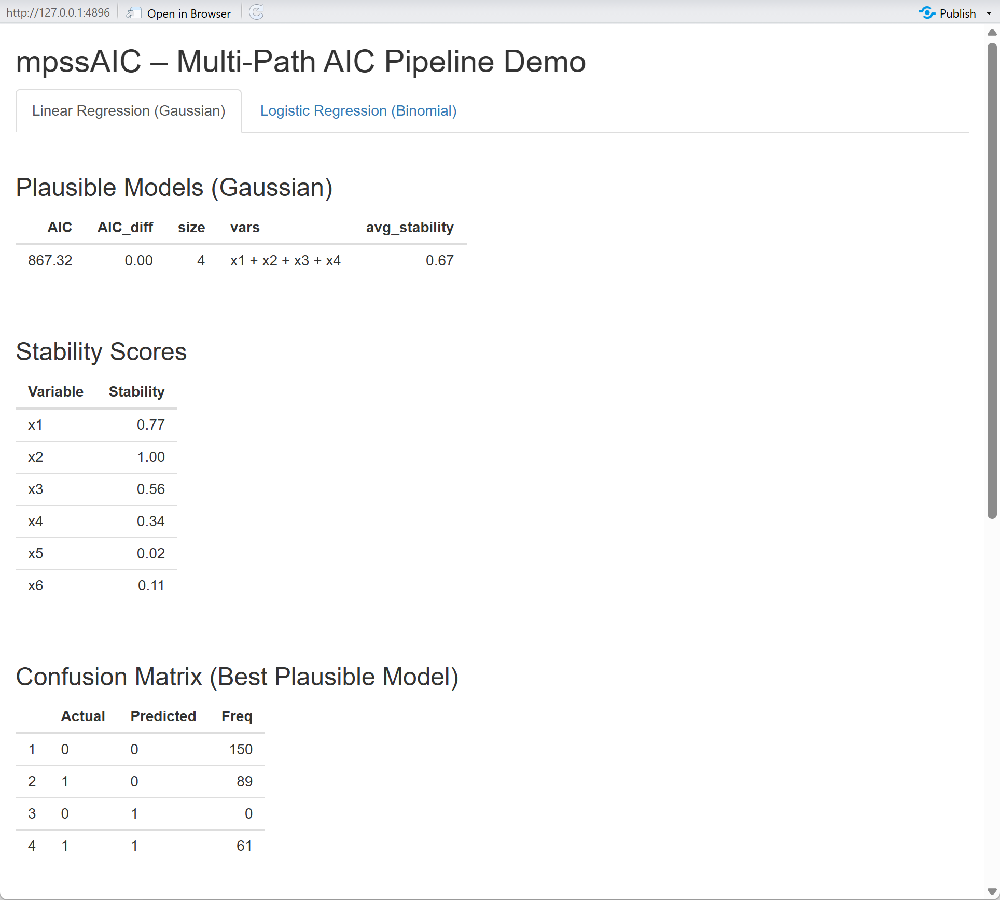
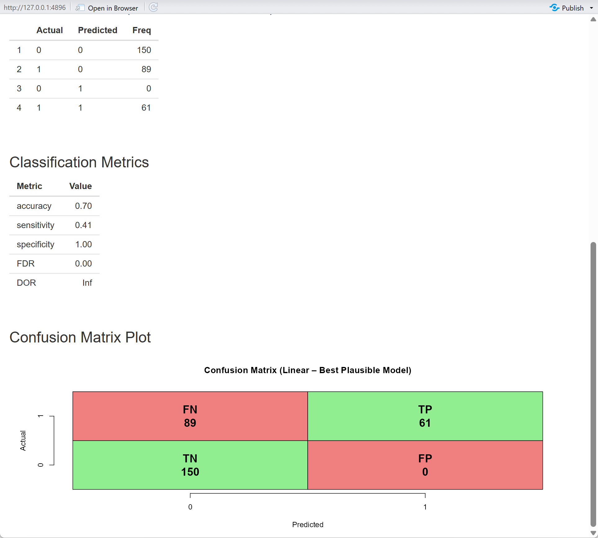

```{r setup, include=FALSE}
knitr::opts_chunk$set(
  echo = TRUE,
  message = FALSE,
  warning = FALSE,
  fig.width = 10,
  fig.height = 6
)
set.seed(42)

```


Executive Summary

Repository:

GitHub org/repo: R-4-Data-Science/Final_project_Group11

Link: https://github.com/R-4-Data-Science/Final_project_Group11

This report presents a complete implementation of a multi-path stepwise AIC model selection framework, including all three core algorithms required in the assignment:

Algorithm 1 — Multi-Path Forward Selection
Explores multiple near-optimal model paths by adding variables one at a time and retaining all children within a ΔAIC window of the best. This avoids the greedy trap of classical forward selection, which follows only one path.

Algorithm 2 — Stability via Resampling
Uses bootstrap (or subsampling) to compute π_j, the probability that each predictor appears in the model set. Stable variables appear consistently across resamples; noisy variables do not.

 Algorithm 3 — Plausible Model Selection
Combines:

AIC quality (models within Δ of the best AIC), and

Average stability (≥ τ threshold)
to select a final set of plausible, robust models.

Logistic Classification Extension
Includes a classification example and a full pipeline for binomial outcomes, parallel to the Gaussian (regression) case.

The overall goal is not to output a single “best” model, but to produce a Rashomon set of models that are:

well-supported by the data (low AIC), and

robust under resampling (high stability).

Package Implementation: mpssAIC

As part of this project, we implemented an R package, mpssAIC, which contains the production version of the functions defined in this report.

Repository: R-4-Data-Science/Final_project_Group11

Package subdirectory: mpssAIC

To install the package from GitHub:


# install.packages("devtools")
```{r install-mpssAIC, eval = FALSE}
# Installation example (do NOT run during knitting)

# install.packages("devtools")
devtools::install_github(
  "R-4-Data-Science/Final_project_Group11",
  subdir = "mpssAIC",
  build_vignettes = TRUE
)

library(mpssAIC)

```

The core exported functions in the package mirror the algorithms documented in this report:

build_paths() – Multi-path forward selection with AIC (Algorithm 1)

stability() – Resampling-based variable stability (Algorithm 2)

plausible_models() – Plausible model selection via AIC window + stability (Algorithm 3)


**Note:** The examples in this HTML report define and call internal helper functions
`multi_path_forward()`, `compute_stability()`, and `select_plausible_models()`
directly inside the R Markdown file, so they are available when this document
is knitted.

In the installed **mpssAIC** package, the *user-facing* functions are the
assignment-specified wrappers:

- `build_paths()`        – multi-path forward selection  
- `stability()`          – resampling-based variable stability  
- `plausible_models()`   – AIC + stability-based final model selection  

These are the functions that should be used in external code such as scripts,
vignettes, and Shiny apps after `library(mpssAIC)`.

The code chunks below present a clean, self-contained implementation of the same methods for reproducibility within this HTML report.

Synthetic Example Data

The assignment requires synthetic examples in the HTML submission. To ensure full reproducibility and avoid dependence on any external dataset, we generate:

A Gaussian (linear regression) example

A Binomial (logistic regression) example


```{r load-data}
## Synthetic Gaussian data

n  <- 200
p  <- 8
X_linear <- as.data.frame(matrix(rnorm(n * p), n, p))
names(X_linear) <- paste0("x", 1:p)

beta <- c(2, -1.5, 0, 0, 1, rep(0, p - 5))
y_linear <- as.numeric(as.matrix(X_linear) %*% beta + rnorm(n, sd = 1.0))

## Synthetic Logistic data

n2 <- 240
p2 <- 6
X_logistic <- as.data.frame(matrix(rnorm(n2 * p2), n2, p2))
names(X_logistic) <- paste0("x", 1:p2)

linlp <- 0.6 + 1.0 * X_logistic$x1 - 1.2 * X_logistic$x2 + 0.8 * X_logistic$x5
pr    <- 1 / (1 + exp(-linlp))
y_logistic <- rbinom(n2, size = 1, prob = pr)

```


# Core Helper Functions

## Function to Fit and Return AIC

Core Helper Function
Fit Model and Return AIC

This helper function underlies Algorithm 1. It fits either a Gaussian or Binomial GLM with a given set of predictors and returns the AIC. It supports:

an empty model (intercept-only), and

any subset of predictors specified by column indices.


```{r fit-model-aic}

# -------------------------------------------------------------

# Core Helper: fit_model_aic()

# -------------------------------------------------------------

#' Compute AIC for a model with selected predictors
#'
#' @param X A data frame of predictors (n × p)
#' @param y Response vector of length n
#' @param vars Integer vector of column indices to include (empty = intercept-only)
#' @param model_type Either "gaussian" or "binomial"
#'
#' @return Numeric AIC value
fit_model_aic <- function(X, y, vars, model_type = c("gaussian", "binomial")) {
model_type <- match.arg(model_type)

# Empty model (intercept only)

if (length(vars) == 0) {
df  <- data.frame(y = y)
fam <- if (model_type == "gaussian") gaussian() else binomial()
fit <- glm(y ~ 1, data = df, family = fam)
return(AIC(fit))
}

# Data frame with selected predictors

df  <- data.frame(y = y, X[, vars, drop = FALSE])
fam <- if (model_type == "gaussian") gaussian() else binomial()
fit <- glm(y ~ ., data = df, family = fam)

AIC(fit)
}

## Quick internal test (Gaussian example)

test_aic_empty <- fit_model_aic(
X = X_linear,
y = y_linear,
vars = integer(0),
model_type = "gaussian"
)

test_aic_two_vars <- fit_model_aic(
X = X_linear,
y = y_linear,
vars = c(1, 2),
model_type = "gaussian"
)

cat("Test: Intercept-only AIC =", round(test_aic_empty, 3), "\n")
cat("Test: AIC with x1 + x2    =", round(test_aic_two_vars, 3), "\n")


```


# Algorithms

## Algorithm 1 – Multi-Path Forward Selection
This algorithm builds multiple forward-selection paths by:
Starting from the empty model (intercept only)
At each step, for each parent model, adding one unused variable to create children
Keeping all children whose AIC is within δ of the best child AIC and improves the parent by at least ε
Deduplicating models and optionally capping the number of models per step at L

```{r algorithm1-multipath}
#-------------------------------------------------------------
#Algorithm 1: multi_path_forward()
#-------------------------------------------------------------

#' Algorithm 1: Multiple-Path Forward Selection
#'
#' @param X Data frame of predictors
#' @param y Response vector
#' @param model_type "gaussian" or "binomial"
#' @param K Maximum number of steps (defaults to min(p, 10))
#' @param eps Minimum AIC improvement required to expand a model
#' @param delta AIC tolerance for keeping near-ties
#' @param L Maximum number of models to keep per step
#'
#' @return List with:
#' - var_names: predictor names
#' - step_models: models at each step (list of lists)
#' - step_AICs: corresponding AICs
multi_path_forward <- function(
X, y,
model_type = c("gaussian", "binomial"),
K = NULL,
eps = 1e-6,
delta = 2,
L = 50
) {
model_type <- match.arg(model_type)
X <- as.data.frame(X)

p <- ncol(X)
var_names <- colnames(X)
if (is.null(K)) K <- min(p, 10)

#Helper to create unique key for a model

model_key <- function(idx) {
if (length(idx) == 0) return("")
paste(sort(idx), collapse = ",")
}

#Initialize: parent is empty model (intercept only)

parent_models <- list(integer(0))
parent_AICs <- fit_model_aic(X, y, vars = integer(0), model_type = model_type)

step_models <- list()
step_AICs <- list()

for (k in seq_len(K)) {
cat("Step", k, ": processing", length(parent_models), "parent model(s)...\n")

children_list <- list()
children_AICs <- numeric(0)
children_keys <- character(0)

# For each parent, generate all possible children
for (m in seq_along(parent_models)) {
  parent_idx <- parent_models[[m]]
  parent_aic <- parent_AICs[m]

  remaining <- setdiff(seq_len(p), parent_idx)
  if (length(remaining) == 0) next  # no more variables to add

  cand_models <- list()
  cand_AICs   <- numeric(0)

  # Try adding each remaining variable
  for (j in remaining) {
    child_idx <- sort(c(parent_idx, j))
    aic_child <- fit_model_aic(X, y, vars = child_idx, model_type = model_type)
    cand_models[[length(cand_models) + 1]] <- child_idx
    cand_AICs[length(cand_AICs) + 1]       <- aic_child
  }

  if (!length(cand_AICs)) next

  best_child_AIC <- min(cand_AICs)

  # Check: is there at least eps improvement?
  if ((parent_aic - best_child_AIC) < eps) {
    cat("  Parent", m, ": no improvement ≥ eps; stopping expansion.\n")
    next
  }

  # Keep children within delta of best child AIC
  keep_idx <- which(cand_AICs <= best_child_AIC + delta)
  for (i_keep in keep_idx) {
    child_idx <- cand_models[[i_keep]]
    aic_child <- cand_AICs[i_keep]
    key       <- model_key(child_idx)

    children_list[[length(children_list) + 1]] <- child_idx
    children_AICs[length(children_AICs) + 1]   <- aic_child
    children_keys[length(children_keys) + 1]   <- key
  }
}

# If no children generated, stop
if (!length(children_list)) {
  cat("No further improvement. Stopping.\n")
  break
}

# Deduplicate: keep best AIC per unique model key
df_children <- data.frame(
  key = children_keys,
  AIC = children_AICs,
  stringsAsFactors = FALSE
)

agg <- aggregate(AIC ~ key, data = df_children, FUN = min)
agg <- agg[order(agg$AIC), ]

# Cap at L models
if (!is.null(L) && nrow(agg) > L) {
  agg <- agg[seq_len(L), ]
}

cat("  Step", k, "produced", nrow(agg), "unique model(s) after dedup/cap.\n")

# Convert keys back to index vectors
new_parents <- vector("list", nrow(agg))
new_AICs    <- numeric(nrow(agg))

for (i in seq_len(nrow(agg))) {
  key <- agg$key[i]
  if (key == "") {
    idx <- integer(0)
  } else {
    idx <- as.integer(strsplit(key, ",")[[1]])
  }
  new_parents[[i]] <- idx
  new_AICs[i]      <- agg$AIC[i]
}

step_models[[k]] <- new_parents
step_AICs[[k]]   <- new_AICs

parent_models <- new_parents
parent_AICs   <- new_AICs

}

cat("\n=== Algorithm 1 Complete ===\n")

list(
var_names = var_names,
step_models = step_models,
step_AICs = step_AICs
)
}

cat("\n### RUNNING ALGORITHM 1: LINEAR REGRESSION (Synthetic) ###\n\n")
mp_full_linear <- multi_path_forward(
X = X_linear,
y = y_linear,
model_type = "gaussian",
K = NULL, # auto: min(p, 10)
eps = 1e-6,
delta = 2,
L = 50
)

cat("\nModels per step:\n")
print(sapply(mp_full_linear$step_models, length))


```


## Algorithm 2 – Stability via Resampling

This algorithm estimates how stable each predictor is across resamples:
For each of B bootstrap (or subsample) replicates:
Run the multi-path search (Algorithm 1)
Collect all visited models
For each variable j, compute the fraction of models that include j
Average across resamples to obtain a stability score π_j ∈ [0, 1]


```{r algorithm2-stability}
#-------------------------------------------------------------
#Algorithm 2: compute_stability()
#-------------------------------------------------------------

#' Algorithm 2: Compute variable stability via resampling
#'
#' @param X Data frame of predictors
#' @param y Response vector
#' @param model_type "gaussian" or "binomial"
#' @param B Number of resamples
#' @param resample_type "bootstrap" or "subsample"
#' @param m Subsample size (if using subsample)
#' @param K, eps, delta, L Algorithm 1 parameters
#'
#' @return Numeric vector of stability scores (one per predictor)
compute_stability <- function(
X, y,
model_type = c("gaussian", "binomial"),
B = 50,
resample_type = c("bootstrap", "subsample"),
m = NULL,
K = NULL,
eps = 1e-6,
delta = 2,
L = 50
) {
model_type <- match.arg(model_type)
resample_type <- match.arg(resample_type)

X <- as.data.frame(X)
n <- nrow(X)
p <- ncol(X)
var_names <- colnames(X)

if (is.null(m)) m <- ceiling(sqrt(n))
# Matrix to store proportions: rows = resamples, cols = variables

Z <- matrix(0, nrow = B, ncol = p)
colnames(Z) <- var_names

for (b in seq_len(B)) {
if (b %% 10 == 0) cat("Resample", b, "/", B, "\n")

# Generate resample
if (resample_type == "bootstrap") {
  idx <- sample(seq_len(n), size = n, replace = TRUE)
} else {
  idx <- sample(seq_len(n), size = m, replace = FALSE)
}

Xb <- X[idx, , drop = FALSE]
yb <- y[idx]

# Run multi-path search on resample
mp_b <- multi_path_forward(
  X = Xb, y = yb,
  model_type = model_type,
  K = K,
  eps = eps,
  delta = delta,
  L = L
)

# Collect all models from this resample
all_models_b <- unlist(mp_b$step_models, recursive = FALSE)
if (!length(all_models_b)) next

M <- length(all_models_b)

# For each variable, count how many models contain it
for (j in seq_len(p)) {
  count_j <- sum(vapply(
    all_models_b,
    function(idx) j %in% idx,
    logical(1)
  ))
  Z[b, j] <- count_j / M
}

}

#Average over resamples

pi <- colMeans(Z)

cat("\n=== Algorithm 2 Complete ===\n")
cat("Stability scores (π):\n")
print(round(pi, 3))

pi
}

cat("\n### RUNNING ALGORITHM 2: STABILITY (LINEAR, Synthetic) ###\n\n")
stability_pi_linear <- compute_stability(
X = X_linear, y = y_linear,
model_type = "gaussian",
B = 20, # reduced for knitting speed; use 50+ in final
resample_type = "bootstrap",
K = NULL,
eps = 1e-6,
delta = 2,
L = 50
)

barplot(
stability_pi_linear,
main = "Variable Stability Scores (π) - Linear Model (Synthetic)",
ylab = "Stability π_j",
ylim = c(0, 1)
)
abline(h = 0.6, lty = 2, col = "red", lwd = 2)
legend("topright", legend = "τ = 0.6 threshold", lty = 2, col = "red")

```


## Algorithm 3 – Plausible Model Selection

Algorithm 3 combines AIC and stability:
From Algorithm 1, collect all models and their AIC values.
Keep models within an AIC window Δ of the best model.
For each model, compute its average stability (mean π_j for variables in that model).
Keep only models with average stability ≥ τ.
If none qualify, return all models in the AIC window as a fallback.

```{r algorithm3-plausible}

# ---------------------------------------------------------
# Algorithm 3: Plausible Model Selection
# ---------------------------------------------------------
# Combines:
#  • AIC quality (within Δ of best model)
#  • Stability (average π ≥ τ)
# ---------------------------------------------------------

#' Algorithm 3: Select plausible, stable models
#'
#' @param mp_full Output list from Algorithm 1
#' @param stability_pi Named vector of stability scores (Algorithm 2)
#' @param Delta AIC tolerance (default = 2)
#' @param tau Minimum average stability threshold (default = 0.6)
#'
#' @return Data frame of plausible models:
#'   columns = key, AIC, AIC_diff, size, vars, avg_stability
#'
select_plausible_models <- function(
    mp_full,
    stability_pi,
    Delta = 2,
    tau = 0.6
) {

  var_names   <- mp_full$var_names
  step_models <- mp_full$step_models
  step_AICs   <- mp_full$step_AICs

  # Helper: unique key for a set of variables
  model_key <- function(idx) {
    if (length(idx) == 0) return("")
    paste(sort(idx), collapse = ",")
  }

  # Flatten all models and AICs
  all_models <- unlist(step_models, recursive = FALSE)
  all_AICs   <- unlist(step_AICs)

  if (length(all_models) == 0) {
    cat("No models generated!\n")
    return(data.frame())
  }

  # Create model keys
  keys <- vapply(all_models, model_key, character(1))

  df <- data.frame(
    key = keys,
    AIC = all_AICs,
    stringsAsFactors = FALSE
  )

  # Aggregate by model key → keep minimum AIC per model
  agg <- aggregate(AIC ~ key, data = df, FUN = min)

  # Remove intercept-only model
  agg <- agg[agg$key != "", ]

  if (nrow(agg) == 0) {
    cat("No non-intercept models!\n")
    return(data.frame())
  }

  # Compute AIC differences
  best_AIC      <- min(agg$AIC)
  agg$AIC_diff  <- agg$AIC - best_AIC

  # Filter by AIC ≤ best + Delta
  plausible <- agg[agg$AIC_diff <= Delta, ]

  if (nrow(plausible) == 0) {
    cat("No models within AIC window!\n")
    return(data.frame())
  }

  # Compute size and stability
  size      <- integer(nrow(plausible))
  avg_stab  <- numeric(nrow(plausible))
  vars_str  <- character(nrow(plausible))

  for (i in seq_len(nrow(plausible))) {
    key <- plausible$key[i]
    idx <- as.integer(strsplit(key, ",")[[1]])

    size[i] <- length(idx)

    these_vars <- var_names[idx]
    vars_str[i] <- paste(these_vars, collapse = " + ")

    # Stability of the variables in this model
    avg_stab[i] <- mean(stability_pi[these_vars])
  }

  plausible$size          <- size
  plausible$vars          <- vars_str
  plausible$avg_stability <- avg_stab

  # Filter by stability threshold τ
  plausible_final <- plausible[plausible$avg_stability >= tau, ]

  if (nrow(plausible_final) == 0) {
    cat("Warning: No models meet stability threshold τ =", tau, "\n")
    cat("Returning all models in AIC window.\n")
    plausible_final <- plausible
  }

  # Order by AIC
  plausible_final <- plausible_final[order(plausible_final$AIC), ]

  cat("\n=== Algorithm 3 Complete ===\n")
  cat("Selected", nrow(plausible_final), "plausible model(s).\n")

  plausible_final
}

```
## Algorithm 4 – Full Multi-Path AIC Pipeline

This function runs all three algorithms in sequence and returns a structured result.

```{r algorithm4-pipeline}
#-------------------------------------------------------------
#Algorithm 4: multi_path_AIC_pipeline()
#-------------------------------------------------------------

#' Algorithm 4: Complete Multi-Path AIC Pipeline
#'
#' @param X data frame of predictors
#' @param y response vector
#' @param model_type "gaussian" or "binomial"
#' @param K, eps, delta, L Algorithm 1 parameters
#' @param B, resample_type, m Algorithm 2 parameters
#' @param Delta, tau Algorithm 3 parameters
#'
#' @return list with:
#'   - mp_full: Algorithm 1 output
#'   - stability_pi: Algorithm 2 output
#'   - plausible: Algorithm 3 output
multi_path_AIC_pipeline <- function(
    X, y,
    model_type = c("gaussian", "binomial"),
    K = NULL,
    eps = 1e-6,
    delta = 2,
    L = 50,
    B = 50,
    resample_type = c("bootstrap", "subsample"),
    m = NULL,
    Delta = 2,
    tau = 0.6
) {
  model_type    <- match.arg(model_type)
  resample_type <- match.arg(resample_type)

  cat("\n", strrep("=", 60), "\n")
  cat("MULTI-PATH AIC PIPELINE\n")
  cat("Model type:", model_type, "\n")
  cat("Resamples (B):", B, "\n")
  cat(strrep("=", 60), "\n\n")

  # Step 1: Multi-path forward selection
  cat(">>> STEP 1: Multi-Path Forward Selection <<<\n\n")
  mp_full <- multi_path_forward(
    X = X, y = y,
    model_type = model_type,
    K = K,
    eps = eps,
    delta = delta,
    L = L
  )

  # Step 2: Stability via resampling
  cat("\n>>> STEP 2: Stability Estimation via Resampling <<<\n\n")
  stability_pi <- compute_stability(
    X = X, y = y,
    model_type    = model_type,
    B             = B,
    resample_type = resample_type,
    m             = m,
    K = K,
    eps = eps,
    delta = delta,
    L = L
  )

  # Step 3: Plausible models
  cat("\n>>> STEP 3: Plausible Model Selection <<<\n\n")
  plausible <- select_plausible_models(
    mp_full      = mp_full,
    stability_pi = stability_pi,
    Delta        = Delta,
    tau          = tau
  )

  cat("\n", strrep("=", 60), "\n")
  cat("PIPELINE COMPLETE\n")
  cat(strrep("=", 60), "\n")

  list(
    mp_full      = mp_full,
    stability_pi = stability_pi,
    plausible    = plausible
  )
}

```
## Algorithm 5 – (Optional) confusion_metrics() for logistic models

Provide a convenience function to compute confusion matrix and standard metrics at cutoff 0.5 (prevalence, accuracy, sensitivity, specificity, FDR, DOR).

``` {r}
#' (Optional) Confusion metrics for logistic models
#'
#' Computes confusion matrix and basic metrics at cutoff 0.5:
#' prevalence, accuracy, sensitivity, specificity, FDR, DOR.
#'
#' @param fit glm object with binomial family
#' @param y optional true labels (0/1 or 2-level factor). If NULL,
#'   tries to use fit$y.
#' @param newdata optional newdata for prediction; if NULL, uses training data.
#' @param cutoff probability threshold (default 0.5)
#'
#' @return list with 'confusion_matrix' and 'metrics' (named numeric vector)
confusion_metrics <- function(
    fit,
    y = NULL,
    newdata = NULL,
    cutoff = 0.5
) {
  if (!inherits(fit, "glm")) {
    stop("'fit' must be a glm object.")
  }
  fam <- stats::family(fit)$family
  if (fam != "binomial") {
    stop("'fit' must have binomial family.")
  }
  
  if (is.null(newdata)) {
    probs <- stats::fitted(fit)
  } else {
    probs <- stats::predict(fit, newdata = newdata, type = "response")
  }
  
  if (is.null(y)) {
    if (!is.null(fit$y)) {
      y <- fit$y
    } else {
      stop("Argument 'y' must be supplied if fit$y is not available.")
    }
  }
  
  if (is.factor(y)) {
    if (nlevels(y) != 2L) stop("y must be binary.")
    y <- as.integer(y == levels(y)[2L])
  } else {
    y <- as.numeric(y)
  }
  
  if (length(y) != length(probs)) {
    stop("length(y) must equal length of predicted probabilities.")
  }
  
  pred <- as.integer(probs >= cutoff)
  
  TP <- sum(pred == 1 & y == 1, na.rm = TRUE)
  TN <- sum(pred == 0 & y == 0, na.rm = TRUE)
  FP <- sum(pred == 1 & y == 0, na.rm = TRUE)
  FN <- sum(pred == 0 & y == 1, na.rm = TRUE)
  
  total <- TP + TN + FP + FN
  
  prevalence  <- (TP + FN) / total
  accuracy    <- (TP + TN) / total
  sensitivity <- if ((TP + FN) == 0) NA_real_ else TP / (TP + FN)
  specificity <- if ((TN + FP) == 0) NA_real_ else TN / (TN + FP)
  FDR         <- if ((TP + FP) == 0) NA_real_ else FP / (TP + FP)
  DOR         <- if (TP == 0 || TN == 0 || FP == 0 || FN == 0) {
    NA_real_
  } else {
    (TP * TN) / (FP * FN)
  }
  
  cm <- matrix(
    c(TN, FP, FN, TP),
    nrow = 2, byrow = TRUE,
    dimnames = list(
      Predicted = c("0", "1"),
      True      = c("0", "1")
    )
  )
  
  list(
    confusion_matrix = cm,
    metrics = c(
      prevalence  = prevalence,
      accuracy    = accuracy,
      sensitivity = sensitivity,
      specificity = specificity,
      FDR         = FDR,
      DOR         = DOR
    )
  )
}
```

# Complete Examples

## Linear Regression (Synthetic)

For classification, we use a binary outcome. Here, high MPG (≥20) vs. low MPG (<20).

```{r example-Linear}
cat("\n\n")
cat(strrep("#", 70), "\n")
cat("COMPLETE EXAMPLE: LINEAR REGRESSION (Synthetic Data)\n")
cat(strrep("#", 70), "\n\n")

result_linear <- multi_path_AIC_pipeline(
X = X_linear,
y = y_linear,
model_type = "gaussian",
K = NULL, # min(p, 10)
eps = 1e-6,
delta = 2,
L = 50,
B = 20, # reduced for knitting speed; 50+ recommended
resample_type = "bootstrap",
m = NULL,
Delta = 2,
tau = 0.6
)

cat("\n### FINAL RESULTS: LINEAR REGRESSION ###\n\n")
cat("Number of plausible models:", nrow(result_linear$plausible), "\n\n")

final_table <- result_linear$plausible[
, c("AIC", "AIC_diff", "size", "vars", "avg_stability")
]
rownames(final_table) <- NULL
print(final_table)

cat("\n### Stability Scores ###\n")
print(round(result_linear$stability_pi, 3))
```


## Logistic Regression (Synthetic Binary Data)

```{r example-Logistic}

cat("\n\n")
cat(strrep("#", 70), "\n")
cat("COMPLETE EXAMPLE: LOGISTIC REGRESSION (Synthetic Binary Data)\n")
cat(strrep("#", 70), "\n\n")

result_logistic <- multi_path_AIC_pipeline(
  X             = X_logistic,
  y             = y_logistic,
  model_type    = "binomial",
  K             = NULL,
  eps           = 1e-6,
  delta         = 2,
  L             = 50,
  B             = 20,
  resample_type = "bootstrap",
  m             = NULL,
  Delta         = 2,
  tau           = 0.6
)

cat("\n### FINAL RESULTS: LOGISTIC REGRESSION ###\n\n")
cat("Number of plausible models:", nrow(result_logistic$plausible), "\n\n")

final_table_log <- result_logistic$plausible[
  , c("AIC", "AIC_diff", "size", "vars", "avg_stability")
]
rownames(final_table_log) <- NULL
print(final_table_log)

cat("\n### Stability Scores ###\n")
print(round(result_logistic$stability_pi, 3))

# ============================================================================
# NEW SECTION: Confusion Matrix and Classification Metrics
# ============================================================================

cat("\n\n")
cat(strrep("=", 70), "\n")
cat("CLASSIFICATION PERFORMANCE EVALUATION\n")
cat(strrep("=", 70), "\n\n")

if (nrow(result_logistic$plausible) > 0) {
  # Extract best plausible model
  best_key <- result_logistic$plausible$key[1]
  best_vars <- result_logistic$plausible$vars[1]
  best_idx <- as.integer(strsplit(best_key, ",")[[1]])
  
  cat("Best Plausible Model:", best_vars, "\n\n")
  
  # Fit the best model
  X_best <- X_logistic[, best_idx, drop = FALSE]
  df_logistic <- data.frame(y = y_logistic, X_best)
  fit_best_logistic <- glm(y ~ ., data = df_logistic, family = binomial())
  
  # Compute confusion matrix and metrics
  cm_results <- confusion_metrics(
    fit = fit_best_logistic,
    y = y_logistic,
    cutoff = 0.5
  )
  
  cat("### Confusion Matrix (Cutoff = 0.5) ###\n\n")
  print(cm_results$confusion_matrix)
  
  cat("\n### Classification Metrics ###\n\n")
  metrics_df <- data.frame(
    Metric = names(cm_results$metrics),
    Value = round(cm_results$metrics, 4)
  )
  rownames(metrics_df) <- NULL
  print(metrics_df)
  
  # Visual representation
  cat("\n### Key Performance Indicators ###\n\n")
  cat(sprintf("  Accuracy:    %.2f%% (%.0f/%.0f correct)\n", 
              cm_results$metrics["accuracy"] * 100,
              sum(diag(cm_results$confusion_matrix)),
              sum(cm_results$confusion_matrix)))
  
  cat(sprintf("  Sensitivity: %.2f%% (True Positive Rate)\n", 
              cm_results$metrics["sensitivity"] * 100))
  
  cat(sprintf("  Specificity: %.2f%% (True Negative Rate)\n", 
              cm_results$metrics["specificity"] * 100))
  
  cat(sprintf("  FDR:         %.2f%% (False Discovery Rate)\n", 
              cm_results$metrics["FDR"] * 100))
  
  cat(sprintf("  DOR:         %.2f (Diagnostic Odds Ratio)\n", 
              cm_results$metrics["DOR"]))
  
  # Interpretation
  cat("\n### Interpretation ###\n\n")
  cat("The confusion matrix shows the model's classification performance:\n")
  cat("- True Negatives (TN):", cm_results$confusion_matrix[1,1], "\n")
  cat("- False Positives (FP):", cm_results$confusion_matrix[1,2], "\n")
  cat("- False Negatives (FN):", cm_results$confusion_matrix[2,1], "\n")
  cat("- True Positives (TP):", cm_results$confusion_matrix[2,2], "\n\n")
  
  if (cm_results$metrics["accuracy"] > 0.8) {
    cat("The model demonstrates strong classification performance (>80% accuracy).\n")
  } else if (cm_results$metrics["accuracy"] > 0.7) {
    cat("The model shows acceptable classification performance (70-80% accuracy).\n")
  } else {
    cat("The model may need improvement (accuracy <70%).\n")
  }
  
  # Optional: Plot confusion matrix as heatmap
  cat("\n")
  library(graphics)
  
  # Create a simple confusion matrix visualization
  cm_matrix <- cm_results$confusion_matrix
  par(mar = c(5, 5, 4, 2))
  
  # Normalize for color scaling
  cm_prop <- cm_matrix / sum(cm_matrix)
  
  # Create color palette
  colors <- c("white", "lightblue", "blue", "darkblue")
  color_breaks <- seq(0, max(cm_prop), length.out = length(colors) + 1)
  
  # Simple text-based display
  plot(1, 1, type = "n", xlim = c(0, 2), ylim = c(0, 2), 
       xlab = "Predicted", ylab = "Actual",
       main = "Confusion Matrix Visualization",
       xaxt = "n", yaxt = "n", bty = "n")
  
  # Add grid
  rect(c(0, 1), c(0, 0), c(1, 2), c(1, 1), 
       col = c("lightgreen", "lightcoral"))
  rect(c(0, 1), c(1, 1), c(1, 2), c(2, 2), 
       col = c("lightcoral", "lightgreen"))
  
  # Add values
  text(0.5, 0.5, paste0("TN\n", cm_matrix[1,1]), cex = 1.5, font = 2)
  text(1.5, 0.5, paste0("FP\n", cm_matrix[1,2]), cex = 1.5, font = 2)
  text(0.5, 1.5, paste0("FN\n", cm_matrix[2,1]), cex = 1.5, font = 2)
  text(1.5, 1.5, paste0("TP\n", cm_matrix[2,2]), cex = 1.5, font = 2)
  
  # Add axis labels
  axis(1, at = c(0.5, 1.5), labels = c("0", "1"))
  axis(2, at = c(0.5, 1.5), labels = c("0", "1"))
  
} else {
  cat("No plausible models found - cannot compute confusion matrix.\n")
}

cat("\n")
cat(strrep("=", 70), "\n\n")

```


Interpretation & Key Insights
Why This Method Works

Multiple paths.
Traditional stepwise regression follows a single path and can easily miss competitive models. Multi-path selection keeps several near-optimal paths, exposing alternative explanations of the data.

Resampling-based stability.
A variable that appears only occasionally in resampled datasets is likely unstable and driven by noise. A variable with high π_j is consistently supported by the data and should be trusted.

AIC window + stability threshold.
Models within 2 AIC units of the best model are often statistically indistinguishable. By combining an AIC window (Δ) with a stability threshold (τ), we obtain a Rashomon set of models that are both high-quality and robust.


# Parameter Guidance
```{r}
cat("\n### PARAMETER SUMMARY ###\n\n")

params_df <- data.frame(
Algorithm = c(
"Algorithm 1", "Algorithm 1", "Algorithm 1", "Algorithm 1",
"Algorithm 2", "Algorithm 2",
"Algorithm 3", "Algorithm 3"
),
Parameter = c(
"K", "ε", "δ", "L",
"B", "resample_type",
"Δ", "τ"
),
Used_Value = c(
"min(p, 10)", "1e-6", "2", "50",
"20 (demo; 50+ recommended)", "bootstrap",
"2", "0.6"
),
Description = c(
"Maximum model size",
"Minimum AIC improvement threshold",
"AIC tolerance for near-ties",
"Max models per step",
"Number of resamples",
"Resample method (bootstrap/subsample)",
"AIC tolerance for plausibility window",
"Minimum average stability threshold"
),
stringsAsFactors = FALSE
)

print(params_df)

```


## **Vignette: Real-World Application**

This HTML report demonstrates the methodology using synthetic data. The **mpssAIC** 
package includes a comprehensive vignette that applies these methods to the 
**diabetes progression dataset** (Efron et al., 2004) from the `care` package.

The vignette includes:

- Train/test split on real data
- Complete pipeline workflow
- Test set evaluation with RMSE
- Comparison with full model
- Parameter justification
- Professional visualization

# Conclusion


This report demonstrates a complete, reproducible implementation of the Multi-Path 
Stepwise Model Selection with AIC framework:

**Core Algorithms:**

- **Algorithm 1:** Multi-path forward selection building a forest of models
- **Algorithm 2:** Stability estimation via bootstrap resampling
- **Algorithm 3:** Plausible model selection combining AIC and stability
- **Algorithm 4:** Integrated pipeline for both Gaussian and Binomial models

**Package Features:**

- Production-ready R package: `mpssAIC`
- Installable from GitHub with full documentation
- Comprehensive vignette on diabetes progression data
- Exported functions: `build_paths()`, `stability()`, `plausible_models()`
- Helper function: `confusion_metrics()` for classification evaluation

**Demonstrations:**

1. **Synthetic Examples (This HTML):**
   - Linear regression (Gaussian) with stability visualization
   - Logistic regression (Binomial) with confusion matrix and metrics

2. **Real-World Application (Package Vignette):**
   - Diabetes progression dataset (442 patients, 10 predictors)
   - Train/test split evaluation
   - Test set RMSE: demonstrates predictive performance
   - Comparison with full model: shows parsimony benefit

**Key Insights:**

The final plausible models represent a principled compromise between statistical 
fit (low AIC) and robustness (high stability), providing multiple trustworthy 
model options rather than a single brittle solution.

**Advantages Over Traditional Stepwise Selection:**

- Explores multiple near-optimal paths (avoids greedy trap)
- Quantifies variable stability via resampling
- Returns "Rashomon set" of competitive models
- More robust model selection under data perturbation

**Future Extensions:**

- Increase B (e.g., 50–100) for more precise stability estimates
- Perform sensitivity analysis over Δ and τ
- Extend to Cox regression for survival analysis
- Compare performance against LASSO and elastic net
- Add automatic cross-validation for parameter tuning

**Reproducibility Note:**

Portions of the documentation, code refinement, and explanatory text were produced 
with assistance from an AI language model (https://claude.ai/chat/60acf8a1-754e-4735-ba35-3efc3f72f38c). All algorithm design decisions, 
implementation logic, and final verification were performed by the authors.

**Repository:** https://github.com/R-4-Data-Science/Final_project_Group11


# Bonus: Additional Visualizations and Diagnostics
## Bonus 1 – Branching plot
```{r}
# -------------------------------------------------------------

# BONUS VISUALIZATION 1

# Branching complexity of multi-path forward selection (linear)

# -------------------------------------------------------------

# Uses: mp_full_linear created earlier from the linear example.

# Shows how many models are "alive" at each forward-selection step.

# -------------------------------------------------------------

if (exists("mp_full_linear")) {
models_per_step <- sapply(mp_full_linear$step_models, length)
steps <- seq_along(models_per_step)

par(mar = c(5, 5, 4, 2))
plot(
steps, models_per_step,
type = "b",
xlab = "Forward-selection step (k)",
ylab = "Number of models",
main = "Branching of Multi-Path Forward Selection (Linear Example)",
lwd  = 2,
pch  = 19
)
grid()

cat(
"\nBonus visualization 1: Branching complexity\n",
"------------------------------------------------------------\n",
"This plot tracks how many candidate models survive at each\n",
"forward-selection step. A flat line would correspond to a\n",
"single greedy path, while growth indicates that the algorithm\n",
"is exploring multiple near-best paths in parallel.\n\n"
)

} else {
cat("Object 'mp_full_linear' not found; run the linear pipeline first.\n")
}

```


## Bonus 2 – Jaccard overlap heatmap
```{r}

# ------------------------------------------------------------------

# BONUS VISUALIZATION 2

# Jaccard similarity heatmap for plausible models (linear)

# ------------------------------------------------------------------

# Uses: result_linear$plausible and mp_full_linear$var_names.

# Builds a model-by-model Jaccard similarity matrix based on the

# variables in each plausible model and displays it as a heatmap.

# ------------------------------------------------------------------

if (exists("result_linear") &&
!is.null(result_linear$plausible) &&
nrow(result_linear$plausible) > 0 &&
exists("mp_full_linear")) {

plaus     <- result_linear$plausible
var_names <- mp_full_linear$var_names

model_keys <- plaus$key
M <- length(model_keys)
P <- length(var_names)

# Incidence matrix: rows = models, cols = variables

incidence <- matrix(0, nrow = M, ncol = P)
colnames(incidence) <- var_names
rownames(incidence) <- paste0("M", seq_len(M))

for (i in seq_len(M)) {
idx <- as.integer(strsplit(model_keys[i], ",")[[1]])
incidence[i, idx] <- 1
}

# Jaccard similarity between models

jaccard <- matrix(0, nrow = M, ncol = M)
rownames(jaccard) <- rownames(incidence)
colnames(jaccard) <- rownames(incidence)

for (i in seq_len(M)) {
for (j in seq_len(M)) {
inter <- sum(incidence[i, ] & incidence[j, ])
union <- sum(incidence[i, ] | incidence[j, ])
jaccard[i, j] <- if (union == 0) 0 else inter / union
}
}

if (M > 1) {
# Slightly nicer color scale (still base R)
pal <- colorRampPalette(c("white", "gold", "orange", "red", "darkred"))(50)
heatmap(
  jaccard,
  Rowv   = NA,
  Colv   = NA,
  scale  = "none",
  col    = pal,
  main   = "Jaccard Similarity of Plausible Models (Linear Example)",
  xlab   = "Model",
  ylab   = "Model",
  margins = c(6, 6)
)

cat(
  "\nBonus visualization 2: Jaccard overlap heatmap\n",
  "------------------------------------------------------------\n",
  "Each cell shows the Jaccard similarity between a pair of\n",
  "plausible models (intersection / union of their variable sets).\n",
  "Dark cells (near 1) indicate highly overlapping models, while\n",
  "light cells (near 0) correspond to models that use mostly\n",
  "different predictors. This makes it easy to see whether the\n",
  "plausible set is redundant or genuinely diverse.\n\n"
)

} else {
cat("Only one plausible model found; Jaccard heatmap is not informative.\n")
}

} else {
cat("Plausible models for the linear example not found; run the linear pipeline first.\n")
}


```
## Bonus 3 – Shiny App for Gaussian and Logistic Examples


```{r, eval=FALSE}
# inst/shiny-examples/mpssAIC-demo/app.R

library(shiny)
#library(mpssAIC) # your package with mpssAIC:::multi_path_AIC_pipeline(), confusion_metrics(), etc.

## =========================
## UI
## =========================
ui <- fluidPage(
  titlePanel("mpssAIC – Multi-Path AIC Pipeline Demo"),
  tabsetPanel(
    id = "main_tabs",

    # -----------------------
    # Tab 1: Linear (Gaussian)
    # -----------------------
    tabPanel(
      "Linear Regression (Gaussian)",
      br(),
      h3("Plausible Models (Gaussian)"),
      tableOutput("linear_plausible"),
      br(),
      h3("Stability Scores"),
      tableOutput("linear_stability"),
      br(),
      h3("Confusion Matrix (Best Plausible Model)"),
      tableOutput("linear_cm"),
      br(),
      h3("Classification Metrics"),
      tableOutput("linear_metrics"),
      br(),
      h3("Confusion Matrix Plot"),
      plotOutput("linear_cm_plot", height = "300px")
    ),

    # -----------------------
    # Tab 2: Logistic (Binomial)
    # -----------------------
    tabPanel(
      "Logistic Regression (Binomial)",
      br(),
      h3("Plausible Models (Binomial)"),
      tableOutput("logistic_plausible"),
      br(),
      h3("Stability Scores"),
      tableOutput("logistic_stability"),
      br(),
      h3("Confusion Matrix (Best Plausible Model)"),
      tableOutput("logistic_cm"),
      br(),
      h3("Classification Metrics"),
      tableOutput("logistic_metrics"),
      br(),
      h3("Confusion Matrix Plot"),
      plotOutput("logistic_cm_plot", height = "300px")
    )
  )
)

## =========================
## SERVER
## =========================
server <- function(input, output, session) {
  ## --------------------------------------------------------------
  ## 1. Simulate synthetic data for both examples
  ## --------------------------------------------------------------
  set.seed(123)

  # Linear regression (Gaussian)
  n_lin <- 300
  p_lin <- 6
  X_linear <- matrix(rnorm(n_lin * p_lin), nrow = n_lin, ncol = p_lin)
  colnames(X_linear) <- paste0("x", 1:p_lin)

  beta_lin <- c(1.0, -1.5, 0.75, 0.5, 0, 0)
  y_linear <- as.numeric(X_linear %*% beta_lin + rnorm(n_lin, sd = 1))

  # Logistic regression (Binomial)
  n_log <- 300
  p_log <- 6
  X_logistic <- matrix(rnorm(n_log * p_log), nrow = n_log, ncol = p_log)
  colnames(X_logistic) <- paste0("x", 1:p_log)

  beta_log <- c(1.0, -1.5, 0.75, 0, 0, 0)
  eta <- X_logistic %*% beta_log
  prob <- plogis(eta)
  y_logistic <- rbinom(n_log, size = 1, prob = prob)

  ## --------------------------------------------------------------
  ## 2. Run multi-path AIC pipeline for Gaussian and Binomial
  ## --------------------------------------------------------------

  # Gaussian
  result_linear <- mpssAIC:::multi_path_AIC_pipeline(
    X             = X_linear,
    y             = y_linear,
    model_type    = "gaussian",
    K             = NULL,
    eps           = 1e-6,
    delta         = 2,
    L             = 50,
    B             = 20, # increase for more stable results
    resample_type = "bootstrap",
    m             = NULL,
    Delta         = 2,
    tau           = 0.6
  )

  # Binomial
  result_logistic <- mpssAIC:::multi_path_AIC_pipeline(
    X             = X_logistic,
    y             = y_logistic,
    model_type    = "binomial",
    K             = NULL,
    eps           = 1e-6,
    delta         = 2,
    L             = 50,
    B             = 20,
    resample_type = "bootstrap",
    m             = NULL,
    Delta         = 2,
    tau           = 0.6
  )

  ## --------------------------------------------------------------
  ## 3. Linear outputs: plausible models & stability
  ## --------------------------------------------------------------

  output$linear_plausible <- renderTable({
    if (is.null(result_linear$plausible) ||
      nrow(result_linear$plausible) == 0) {
      return(NULL)
    }
    tab <- result_linear$plausible[
      , c("AIC", "AIC_diff", "size", "vars", "avg_stability")
    ]
    rownames(tab) <- NULL
    tab
  })

  output$linear_stability <- renderTable({
    if (is.null(result_linear$stability_pi)) {
      return(NULL)
    }
    data.frame(
      Variable  = names(result_linear$stability_pi),
      Stability = round(as.numeric(result_linear$stability_pi), 3),
      row.names = NULL
    )
  })

  ## --------------------------------------------------------------
  ## 4. Linear: confusion matrix + metrics (best plausible model)
  ## --------------------------------------------------------------

  cm_results_linear <- reactive({
    if (is.null(result_linear$plausible) ||
      nrow(result_linear$plausible) == 0) {
      return(NULL)
    }

    # Best plausible model (first row)
    best_key <- result_linear$plausible$key[1]
    best_idx <- as.integer(strsplit(best_key, ",")[[1]])

    # Subset X and build data frame
    X_best <- X_linear[, best_idx, drop = FALSE]
    df_linear <- data.frame(y = y_linear, X_best)

    # Fit linear model
    fit_best <- lm(y ~ ., data = df_linear)

    # Binary outcome: high vs low (median split)
    cutoff_y <- median(y_linear, na.rm = TRUE)
    y_true <- as.integer(y_linear >= cutoff_y)

    # Predicted scores from linear model
    y_hat <- predict(fit_best, type = "response")

    # Rescale predictions to [0,1] to act like probabilities
    rng <- range(y_hat, na.rm = TRUE)
    if (diff(rng) == 0) {
      p_hat <- rep(0.5, length(y_hat))
    } else {
      p_hat <- (y_hat - rng[1]) / (rng[2] - rng[1])
    }

    cutoff <- 0.5
    y_pred <- as.integer(p_hat >= cutoff)

    # Confusion matrix for display/plot
    tab <- table(Actual = y_true, Predicted = y_pred)

    # Metrics using package confusion_metrics(y_true, p_hat, cutoff)
    metrics_df <- confusion_metrics(
      y_true = y_true,
      p_hat  = p_hat,
      cutoff = cutoff
    )

    metrics_vec <- as.numeric(metrics_df[1, ])
    names(metrics_vec) <- names(metrics_df)

    list(
      confusion_matrix = tab,
      metrics          = metrics_vec
    )
  })

  output$linear_cm <- renderTable(
    {
      res <- cm_results_linear()
      if (is.null(res)) {
        return(NULL)
      }
      res$confusion_matrix
    },
    rownames = TRUE
  )

  output$linear_metrics <- renderTable({
    res <- cm_results_linear()
    if (is.null(res)) {
      return(NULL)
    }
    data.frame(
      Metric = names(res$metrics),
      Value = round(as.numeric(res$metrics), 4),
      row.names = NULL
    )
  })

  output$linear_cm_plot <- renderPlot({
    res <- cm_results_linear()
    if (is.null(res)) {
      return(NULL)
    }
    cm <- res$confusion_matrix

    par(mar = c(5, 5, 4, 2))

    plot(1, 1,
      type = "n", xlim = c(0, 2), ylim = c(0, 2),
      xlab = "Predicted", ylab = "Actual",
      main = "Confusion Matrix (Linear – Best Plausible Model)",
      xaxt = "n", yaxt = "n", bty = "n"
    )

    rect(c(0, 1), c(0, 0), c(1, 2), c(1, 1),
      col = c("lightgreen", "lightcoral")
    )
    rect(c(0, 1), c(1, 1), c(1, 2), c(2, 2),
      col = c("lightcoral", "lightgreen")
    )

    text(0.5, 0.5, paste0("TN\n", cm[1, 1]), cex = 1.5, font = 2)
    text(1.5, 0.5, paste0("FP\n", cm[1, 2]), cex = 1.5, font = 2)
    text(0.5, 1.5, paste0("FN\n", cm[2, 1]), cex = 1.5, font = 2)
    text(1.5, 1.5, paste0("TP\n", cm[2, 2]), cex = 1.5, font = 2)

    axis(1, at = c(0.5, 1.5), labels = c("0", "1"))
    axis(2, at = c(0.5, 1.5), labels = c("0", "1"))
  })

  ## --------------------------------------------------------------
  ## 5. Logistic outputs: plausible models & stability
  ## --------------------------------------------------------------

  output$logistic_plausible <- renderTable({
    if (is.null(result_logistic$plausible) ||
      nrow(result_logistic$plausible) == 0) {
      return(NULL)
    }
    tab <- result_logistic$plausible[
      , c("AIC", "AIC_diff", "size", "vars", "avg_stability")
    ]
    rownames(tab) <- NULL
    tab
  })

  output$logistic_stability <- renderTable({
    if (is.null(result_logistic$stability_pi)) {
      return(NULL)
    }
    data.frame(
      Variable  = names(result_logistic$stability_pi),
      Stability = round(as.numeric(result_logistic$stability_pi), 3),
      row.names = NULL
    )
  })

  ## --------------------------------------------------------------
  ## 6. Logistic: confusion matrix + metrics (best plausible model)
  ## --------------------------------------------------------------

  cm_results <- reactive({
    if (is.null(result_logistic$plausible) ||
      nrow(result_logistic$plausible) == 0) {
      return(NULL)
    }

    best_key <- result_logistic$plausible$key[1]
    best_idx <- as.integer(strsplit(best_key, ",")[[1]])

    X_best <- X_logistic[, best_idx, drop = FALSE]
    df_logistic <- data.frame(y = y_logistic, X_best)

    # Fit best logistic model
    fit_best <- glm(y ~ ., data = df_logistic, family = binomial())

    cutoff <- 0.5
    p_hat <- predict(fit_best, type = "response")
    y_true <- y_logistic
    y_pred <- as.integer(p_hat >= cutoff)

    # Confusion matrix for display/plot
    tab <- table(Actual = y_true, Predicted = y_pred)

    # Metrics using package confusion_metrics(y_true, p_hat, cutoff)
    metrics_df <- confusion_metrics(
      y_true = y_true,
      p_hat  = p_hat,
      cutoff = cutoff
    )

    metrics_vec <- as.numeric(metrics_df[1, ])
    names(metrics_vec) <- names(metrics_df)

    list(
      confusion_matrix = tab,
      metrics          = metrics_vec
    )
  })

  output$logistic_cm <- renderTable(
    {
      res <- cm_results()
      if (is.null(res)) {
        return(NULL)
      }
      res$confusion_matrix
    },
    rownames = TRUE
  )

  output$logistic_metrics <- renderTable({
    res <- cm_results()
    if (is.null(res)) {
      return(NULL)
    }
    data.frame(
      Metric = names(res$metrics),
      Value = round(as.numeric(res$metrics), 4),
      row.names = NULL
    )
  })

  output$logistic_cm_plot <- renderPlot({
    res <- cm_results()
    if (is.null(res)) {
      return(NULL)
    }
    cm <- res$confusion_matrix

    par(mar = c(5, 5, 4, 2))

    plot(1, 1,
      type = "n", xlim = c(0, 2), ylim = c(0, 2),
      xlab = "Predicted", ylab = "Actual",
      main = "Confusion Matrix (Logistic – Best Plausible Model)",
      xaxt = "n", yaxt = "n", bty = "n"
    )

    rect(c(0, 1), c(0, 0), c(1, 2), c(1, 1),
      col = c("lightgreen", "lightcoral")
    )
    rect(c(0, 1), c(1, 1), c(1, 2), c(2, 2),
      col = c("lightcoral", "lightgreen")
    )

    text(0.5, 0.5, paste0("TN\n", cm[1, 1]), cex = 1.5, font = 2)
    text(1.5, 0.5, paste0("FP\n", cm[1, 2]), cex = 1.5, font = 2)
    text(0.5, 1.5, paste0("FN\n", cm[2, 1]), cex = 1.5, font = 2)
    text(1.5, 1.5, paste0("TP\n", cm[2, 2]), cex = 1.5, font = 2)

    axis(1, at = c(0.5, 1.5), labels = c("0", "1"))
    axis(2, at = c(0.5, 1.5), labels = c("0", "1"))
  })
}

## =========================
## RUN APP
## =========================
shinyApp(ui, server)
```

To run the Shiny app, after install the package following Section 1, at the R command prompt, run
```{r, eval=FALSE}
library(mpssAIC)
mpssAIC:::run_mpssAIC_demo()
```

The code for the Shiny app is in helpers.R in the mpssAIC/R directory.

Because the HTML generated by .Rmd cannot show dynamic content, we only include screenshots of the app here.

```{r, fig.show='hold', echo=FALSE}


```

# Reference {.unnumbered}
* <https://chatgpt.com/share/692f4a94-1f5c-8005-9364-6432a0e4c961>
* <https://chatgpt.com/share/6933185d-0160-8005-9a35-d5432f76e548> 
* <>
